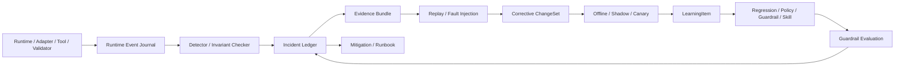

# Plan25：事故学习闭环一等子系统

日期：2026-08-22；2026-08-23 随产品中心纠偏完成 Core/Plugin 泛化

## 当前状态

本计划是 `PROD-00` Runtime Charter 的专项设计产物，状态为 **INC-00 文档冻结完成，PROD-01A 协议地基已实现，持久事故链尚未开始**。它定义事故学习闭环的领域模型、控制边界、持久化语义、分批实施、故障演练和验收口径；当前新增代码只提供 RuntimeEvent/Acceptance/Invocation 协议和同步不变量，尚未修改旧 Runtime 执行行为。

事故学习系统是 Runtime 的横向生产能力，不是某个 Agent 的“反思 Prompt”，也不是失败后自动写入 Memory 的快捷路径。它必须覆盖 Thread、Message、AgentSession、Route、用户介入、媒体绑定、直接模型 API、Full Agent Backend、工具、Context、Memory、调度、预算和人工审批。Workspace、Patch 和 Coding Validator 属 Coding Plugin 的事故子目录，不再定义 Core 的完成语义。

本次泛化遵循 `Plan/Plan26.md`：保留 `RuntimeEvent → Detector/Invariant → IncidentLedger → EvidenceBundle → Replay/FaultInjection → ChangeSet → Shadow/Canary → LearningItem → GuardrailEvaluation` 主链，只纠正 Coding 特有的事实源、事故样例和完成门禁。

本文的“Coding Plugin”表示目标责任边界；当前代码尚无 `CodingPlugin`，Coding 仍是 Composition Root/包内纵向切片，VisionForge 仍是独立 Scenario Plugin。

## 目标与非目标

### 目标

建立如下受治理闭环：

```text
Runtime Event
  → Detector / Invariant
  → Incident Ledger
  → 自动止损与 Evidence Bundle
  → 人工分级、调查和根因确认
  → ReplaySpec 与修复 ChangeSet
  → Offline Replay / Shadow / Canary
  → LearningItem
  → Regression / Policy / Guardrail / Runbook / Skill
  → 后续命中、漏拦、误报、复发和退役统计
```

闭环必须使系统能够回答：

1. 何时、由谁、在哪个 Thread/Turn/Task/AgentSession/Invocation/Attempt 触发了问题；
2. 当时使用了哪个 Harness、Adapter、Model、Prompt、Policy、Schema、Plugin 和 Memory 版本；
3. 哪些上下文、工具调用、Artifact、验证和副作用参与了事故；
4. 哪个不变量、SLO、权限或完成门禁本应阻止或发现问题；
5. 系统如何止损、恢复、重现、修复和验证；
6. 事故最终晋升成了什么可执行防线，以及防线是否真实减少复发。

### 非目标

第一阶段不实现：

- LLM 自动批准事故根因、Policy、Guardrail 或事故关闭；
- 从失败聊天或单次模型总结直接写入长期 Memory；
- 模型生成任意 Python、表达式 DSL 或插件后动态加载；
- 完整 Event Sourcing、复杂事故知识图谱或 GraphRAG；
- 自动修复生产数据、恢复不可逆外部副作用或放宽权限；
- 全量回填旧 `.runs`、旧聊天和历史 SQLite 数据；
- 用一次 Prompt 修改或“暂未复现”作为事故关闭依据。

## 核心原则与硬不变量

### 事实与权力边界

- 事故不是 Memory；Incident Ledger 负责事故聚合、状态和处置历史。
- 原始信号不是根因；模型可以提出 `Claim`，不能把 inference 直接登记为事实。
- 教训不是规则；只有批准、验证并显式注册的实现才能进入 Shadow 或 Active。
- Agent 可以整理证据、提出假设、生成测试和修复草案，不能修改事故事实、扩大权限、批准 Guardrail 或宣布事故结束。
- Runtime、Message/Artifact Store、工具回执和场景 Acceptance Evidence 是执行与验收事实源；Incident 只保存定位引用，不复制或改写事实。Coding Plugin 继续使用 VerificationRecord、Workspace 和 Validator 作为它自己的证据源。

### 永不放宽的不变量

```text
unknown != accepted
AgentClaim != RuntimeAcceptance
缺少 AcceptancePolicy 要求的新鲜、匹配证据不得 accepted
无 capability / grant / approval 不得产生副作用
恢复、重试、取消和迟到结果不得产生重复副作用
跨 Scope / Thread / AgentSession / Artifact / ExecutionEnvironment 的污染必须为 0
预算未预留不得调用模型或高成本工具
```

确定性不变量必须进入代码、Schema、Policy、Validator 或事务边界，不能只写成 Prompt、Skill 或 Runbook。

## 与当前 Core 的增量关系

现有能力继续复用：

| 当前能力 | 在事故闭环中的职责 |
|---|---|
| `RuntimeSnapshot` / `SQLiteRuntimeStore` | 当前 Run 状态和可安全恢复投影；不承担跨 Run 事故聚合 |
| `LifecycleController` / `LifecycleEvent` | 当前进程内状态机和历史；后续投影为持久 Runtime Event |
| `dag_runner.event_listener` | 当前临时事件出口；后续兼容迁移为 `EventSink` |
| `ArtifactStore` | 保存不可变执行、失败、日志、截图和报告证据 |
| `Claim` | 保存 observation、inference 和 proposal，防止调查假设变成事实 |
| `VerificationRecord` | 保存确定性验证证据和三态结论；作为通用 Evidence 类型被场景 AcceptancePolicy 按需引用 |
| `MemoryManager` | 只接收已批准、已验证并 active 的 Context Lesson |
| `ValidatorRegistry` / `CommandPolicy` / `PatchIntegrator` | 已批准确定性 Guardrail 的现有落点 |
| `WorkerRegistry.principal_id` | 调查职责和 Reviewer/Producer 隔离依据 |

新增 Incident/Learning 域不能建立平行的 Task、Artifact、Verification 或 Memory 真相源。它只保存事故状态、发生次数、审批历史、证据定位、修复与发布状态。

第一阶段采用状态表为当前业务真相源、append-only Journal 为不可变审计记录、Snapshot 为兼容恢复检查点；不要求从事件重新计算所有业务状态。达到 `PROD-01B` 强制审计阶段后，关键状态变更、Audit Event 和 Outbox 必须进入同一个 `RuntimeUnitOfWork` 和 SQLite 事务。

## 系统结构



核心模块：

1. `Runtime Event Journal`：不可变审计时间线；
2. `Detector / Invariant Checker`：同步阻断与异步检测；
3. `Incident Ledger`：事故聚合、分级、状态、owner 和处置；
4. `Evidence Bundle`：内容寻址、脱敏、访问受控的现场快照；
5. `Replay / Fault Injection`：确定性重放和受控故障演练；
6. `ChangeSet / Rollout`：版本化修复、Shadow、Canary 和回滚；
7. `Learning / Guardrail`：人工批准的知识晋升与后续效果评价。

## 领域模型

### `RuntimeEvent`

统一事件 Envelope 至少包含：

```text
event_id
schema_version
event_type
aggregate_type / aggregate_id / aggregate_version / sequence_no
trace_id / correlation_id / causation_id / parent_event_id
scope_id / project_id / thread_id / turn_id / message_id / task_id / run_id
agent_instance_id / agent_session_id / session_binding_id
invocation_id / attempt_id / parent_invocation_id / route_edge_id
context_bundle_id / acceptance_policy_id / acceptance_policy_version / acceptance_policy_hash
acceptance_record_id / resource_snapshot_ref
actor_type / actor_id / principal_id
harness_version / adapter_version / model_ref
prompt_version / policy_version / protocol_version / plugin_version
idempotency_key
payload_metadata
artifact_refs / verification_refs / evidence_refs
occurred_at / recorded_at
```

约束：

- `event_id` 全局唯一；同一 aggregate 的 `sequence_no` 严格递增；
- `(aggregate_type, aggregate_id, sequence_no)` 唯一；
- 同一副作用和同一状态提交使用稳定 `idempotency_key`；
- 大正文、媒体、源码、stdout/stderr 和 Provider 原始 Envelope 只保存为受控 Artifact，事件仅保存引用和 hash；
- Event 追加后不可修改；更正必须产生新事件并引用被更正事件；
- 安全、验证、权限、预算和副作用事件禁止采样；
- 写入前执行 secret/PII 脱敏、分类和大小限制。

首批事件目录：

```text
thread.created / archived
turn.opened / closed
message.committed / delivered / rejected
user.intervened / clarification_provided / cancel_requested
agent_session.created / checkpointed / reset
session_binding.bound / rejected / cleared
route.requested / accepted / rejected
handoff.proposed / accepted / rejected
media.ingested / linked / rejected
task.created
lifecycle.transitioned
invocation.queued / claimed / started / completed / failed / cancelled
context.compiled
model.requested / completed / failed
tool.requested / approved / rejected / completed
artifact.committed / rejected
verification.recorded
acceptance.evaluated
outcome.accepted / rejected / needs_input
budget.reserved / settled / exceeded
resource_snapshot.changed / stale_detected
coding:workspace.changed / coding:workspace.drift_detected
incident.detected
containment.applied / reverted
human.decision_recorded
```

### `AcceptancePolicy` 与 `AcceptanceRecord`

Core 必须冻结 Acceptance 的聚合边界，不能只在事件里保存一个 Policy ID：

```text
AcceptancePolicy
  policy_id / version / hash
  subject_type: turn / task / scenario_run / external_action
  required_evidence
  freshness_and_binding_rules
  independent_evaluator_required
  allowed_outcomes

AcceptanceRecord
  record_id
  subject_type / subject_id / subject_version
  policy_id / policy_version / policy_hash
  outcome: accepted / rejected / needs_input / unknown
  evidence_refs
  issued_by: runtime
  evaluator_principal_ids
  evaluated_at
```

Evaluator/Agent 只能提供 Evidence，不能签发 AcceptanceRecord。`continue` 表示 Outcome 保持 unknown 且 Runtime 调度下一 Invocation，不是第五种 Outcome；`blocked/cancelled` 属生命周期状态。长期 Thread 没有通用 accepted 状态；它只能保持 open、paused 或由用户/明确生命周期策略 archived。`Invocation.completed`、`Outcome.accepted` 和 `Thread.archived` 必须分别产生事件，不能互相推导。

### `IncidentSignal`

Detector 或中央 Runtime 边界产生的原始信号：

```text
signal_id
idempotency_key
scope_id / thread_id / turn_id / message_id / task_id / run_id
agent_session_id / session_binding_id / invocation_id / attempt_id / route_edge_id
category / component
summary
violated_invariant / slo_ref
event_refs / evidence_locators / entity_refs
detector_id / detector_version
confidence
metadata
```

`category` 由 Runtime 注册表映射，Worker 和模型不能自由创建安全等级或执行型类别。

首批稳定类别：

- `acceptance_policy_missing`
- `false_acceptance_attempt`
- `message_delivery_state_mismatch`
- `message_duplicate_effect`
- `message_order_violation`
- `wrong_thread_or_session_binding`
- `cross_scope_artifact_access`
- `route_loop_or_no_progress`
- `handoff_contract_violation`
- `user_control_not_honored`
- `media_binding_mismatch`
- `stale_or_unauthorized_context`
- `memory_promotion_violation`
- `capability_route_mismatch`
- `unauthorized_side_effect`
- `worker_unavailable`
- `model_protocol_error`
- `tool_timeout`
- `stuck_cancelling`
- `expired_lease`
- `duplicate_side_effect`
- `budget_overrun`
- `late_attempt_result`
- `security_boundary_rejected`

证据不足可以是正常的 `needs_input/unknown`，不进入 IncidentSignal 稳定类别；`false_acceptance_attempt` 专指 Runtime 在证据不足时仍试图登记 accepted，`acceptance_policy_missing` 则是需要验收的对象没有冻结 Policy 的配置事故。

`message_delivery_state_mismatch` 专指没有 DeliveryAck 却登记 delivered，或 committed Message 永久缺失；客户端暂时离线、等待重试是正常运行状态，只计入投递失败率、重试次数和送达延迟。

Coding Plugin 另外注册 `coding:verification_failed`、`coding:verification_unknown`、`coding:integration_rejected`、`coding:validator_timeout` 和 `coding:workspace_drift`。Core 只理解类别注册、严重级别和证据引用，不解释代码协议。

### `EvidenceLocator` 与 `EvidenceBundle`

`EvidenceLocator` 必须同时保存证据所在容器和引用：

```text
container_type / container_id
reference
content_hash
classification
redaction_state
```

裸 `artifact://...` 不足以跨 Snapshot 和 Run 定位证据。`EvidenceBundle` 至少包含：

- 事故时间窗内的 Runtime Event 引用；
- 事故前后 Runtime Snapshot 与资源/输入快照；Coding 子事故可额外引用 Workspace hash；
- Model/Adapter/Prompt/Schema/Policy/Plugin/Memory 版本；
- Context Manifest、选择理由和来源 hash；
- Tool Call、审批、退出码、副作用 ID 和幂等键；
- Message、Artifact、Claim、Acceptance/Verification Evidence 和场景 Policy；
- Token、费用、重试、延迟和预算状态；
- 自动止损和人工动作；
- 脱敏后的 Provider/进程错误；
- 影响范围和用户可见现象。

Evidence Bundle 是敏感资产，需要访问控制、retention、删除后的引用 tombstone、加密和访问审计。默认只保存 Message/Artifact ID、hash、时间窗、媒体区域/时间片和脱敏摘要；不得复制完整对话、原始媒体、Agent 私有 Session、原始思维链、secret 或完整用户敏感数据。调查者临时访问原始内容必须经过权限检查并产生审计事件。

### `IncidentRecord` 与 `IncidentOccurrence`

`IncidentRecord` 跨 Run 聚合同类事故：

```text
incident_id
scope_id / scope_type
fingerprint / fingerprint_version
category / severity
response_status / investigation_status
first_seen_at / last_seen_at / occurrence_count
affected_scope
violated_invariants / slo_refs
current_mitigation
commander / owner
evidence_bundle_refs
root_cause_status
resolved_by_learning_item_ids
residual_risk
version
```

`IncidentOccurrence` 保存每次真实发生的 thread/turn/message/task/run/session/invocation/attempt、证据引用、时间和幂等键。

- `idempotency_key` 防止同一恢复或重放重复记账；
- `fingerprint` 聚合不同任务中相同机制；
- `fingerprint_version` 允许后续修正归一化算法；
- 不同 Scope 默认不能聚合；跨 Scope 模式只能形成组织级只读分析，不改变原 Scope 事故状态。

### `DetectionRule`

```text
detector_id / version
signal_type
condition / time_window
severity_policy
dedup_fingerprint_policy
required_evidence
auto_mitigation_ref
runbook_ref
mode: shadow / active
```

概率性语义 Detector 只能创建候选 Incident、触发 Shadow 或请求人工调查，不能单独执行破坏性动作。

### `MitigationAction` 与 `HumanDecision`

每个止损动作记录：

```text
action_id / incident_id
action_type / target_scope
reversible
authorization_policy
preconditions
actor / approver
started_at / completed_at
result / evidence_refs
rollback_ref
```

自动化边界由 `置信度 × 可逆性 × 影响范围` 决定。高置信、可逆、范围小且已经在 Runbook 中预批准的动作可以自动执行；不可逆、大范围、放宽权限或数据补偿必须人工批准。

### `ReplaySpec`、`ChangeSet` 与 `VerificationRun`

`ReplaySpec` 固定：

- 事故输入与证据引用；
- Runtime/Adapter/Prompt/Policy/Schema/Model/Memory 版本；
- 固定 Model/Adapter Response Fixture 或真实调用策略；
- Sandbox 和副作用模式；
- Fault Injection 点；
- 预期事件、不变量、终态和指标；
- 重复次数、随机种子和预算；
- 正常对照任务。

`ChangeSet` 将以下内容视为同一可发布变更：

```text
harness_version
adapter_version
prompt_version
policy_version
protocol_version
model_route_version
plugin_version
memory_schema_version
```

`VerificationRun` 记录 offline、shadow、canary、rollout 和 rollback 的环境、cohort、版本、指标、证据和结论。

### `LearningItem` 与 `GuardrailEvaluation`

```text
LearningItem
  learning_item_id
  incident_ids
  kind: context_hint / policy_rule / validator_rule /
        workflow_rule / adapter_rule / regression_test /
        runbook / skill
  observation_claims / inference_claims / proposal_claim
  status
  implementation_ref
  validation_plan
  approved_by / approval_reason
  evidence_refs
  version / supersedes / expiry
  residual_risk

GuardrailEvaluation
  learning_item_id / guardrail_id / version
  scope_id / thread_id
  turn_id / task_id / scenario_run_id
  agent_session_id / invocation_id
  acceptance_policy_id / acceptance_policy_version
  mode: shadow / active
  decision: allowed / would_block / blocked / error
  outcome: prevented / missed / false_positive / unknown
  evidence_refs
  created_at
```

`implementation_ref` 只能解析到代码中显式注册的可信 Guardrail、Validator、Policy 或 Adapter 规则。第一阶段不提供任意规则 DSL。

## 三条相关状态机

### 事故响应

```text
DETECTED
  → TRIAGED
  → CONTAINING
  → CONTAINED
  → RECOVERING
  → RECOVERED
  → CLOSED
```

任一非终态可以进入 `ESCALATED`；已恢复或已关闭事故在新 occurrence 出现后进入 `REOPENED → CONTAINING`。

### 调查与行动

```text
EVIDENCE_SEALED
  → HYPOTHESIS_OPEN
  → RCA_REVIEW
  → RCA_ACCEPTED
  → ACTIONS_ASSIGNED
  → ACTIONS_VERIFIED
```

证据不足时允许 `ROOT_CAUSE_UNKNOWN`，但必须记录已经建立的影响限制、下一证据需求和复审时间，不能强行生成听起来完整的 RCA。

### 变更与知识晋升

```text
PROPOSED
  → APPROVED
  → OFFLINE_VERIFIED
  → SHADOW
  → CANARY
  → ACTIVE
  → STABLE
  → RETIRED
```

`SHADOW / CANARY / ACTIVE` 任一阶段失败后进入 `ROLLED_BACK → PROPOSED`。事故恢复不等待 RCA 和知识晋升完成；事故关闭则必须满足本计划的关闭条件。

## 事故等级与责任

| 等级 | 定义与示例 | 自动处置 | 人工要求 |
|---|---|---|---|
| `SEV0` | 信任边界、secret 泄漏、未授权高风险副作用、造成高风险错误交付的 false acceptance、证据伪造、不可逆数据损坏 | fail-closed、隔离 Scope/Run、撤销短期权限、冻结相关发布 | Incident Commander 批准恢复写操作、确认 RCA、残余风险和关闭 |
| `SEV1` | 已确认事件丢失、重复副作用、Session 串线、孤儿任务、预算硬限制突破、无法恢复 | 隔离 Worker/Provider、暂停相同任务、回滚已批准版本 | 人工确认全面恢复和长期修复 |
| `SEV2` | 局部工作流或 Provider 故障、上下文错误、路由循环、显著成本/延迟回归 | 按预批准 Runbook 降级、熔断或转人工 | 事后人工复核和行动 owner |
| `SEV3` | 单次 Run 失败、低效调用、非关键观测缺失且已安全失败 | 自动恢复、聚合趋势 | 纳入正常 backlog |
| `NEAR_MISS` | Policy、预算、验证或权限正确阻止了影响 | 自动记录控制命中 | 聚合分析；高频或新型 Near Miss 需要人工调查 |

等级取安全、隐私、数据完整性、外部副作用、财务、范围、可逆性和持续时间中的最高影响，不按受影响任务数量简单平均。

## 检测、止损与调查

### 同步 Invariant

首批同步规则：

1. `false_acceptance`：Acceptance Gate 必须找到当前 Policy 要求的新鲜、匹配 Evidence；没有 Policy 或证据不足只能保持 unknown/needs_input/rejected；
2. `independent_evaluator_required`：只有 Policy 声明需要独立评估时，Producer 与 Evaluator principal 才必须分离；
3. `scope_binding`：Message、Session、Artifact、Context 和媒体必须绑定正确 Scope/Thread/Agent；
4. `budget_unreserved`：无预留不得调用模型或高成本工具；
5. `unauthorized_side_effect`：无 Capability/Grant/Approval 不执行；
6. `parent_cancelled`：父任务或用户取消后子 Invocation 不能产生新副作用；
7. `late_attempt_result`：fencing token 过期的 Attempt 结果不能接纳；
8. `resource_snapshot_stale`：输入或资源版本变化后旧结果和旧证明不得接纳；
9. `invocation_close_requires_reaped`：执行状态虽已终止，但活动 Grant、Lease、ChildInvocation、SessionBinding 或执行资源仍存在时不能标记 closed；
10. `non_terminal_descendant_on_close`：Parent 关闭前必须确认所有 ChildInvocation 已终止并完成回收，取消后旧 Attempt 的 Artifact、事件和副作用由 fencing 确定性拒绝。

Coding Plugin 将 `stale_verification`、`self_review_or_verify` 和 `workspace_drift` 注册为上述通用规则的场景化实现；普通对话不要求 Workspace 或独立 Reviewer。

Detector 必须区分 `Invocation.completed`、`Outcome.accepted` 和 `Thread.archived`。技术调用结束不是业务接受证据，Outcome 被接受也不能触发 Thread 自动归档。

### 异步 Detector

首批异步规则：

- `stuck_invocation`
- `stuck_cancelling`
- `expired_lease`
- `orphan_process`
- `orphan_invocation`
- `termination_failed`
- `session_binding_leak`
- `resource_lease_leak`
- `non_terminal_descendant_on_close`
- `duplicate_side_effect`
- `event_projection_gap`
- `provider_error_spike`
- `cost_or_token_anomaly`
- `handoff_loop_or_no_progress`
- `message_delivery_state_mismatch`
- `message_delivery_slo_breach`
- `message_order_violation`
- `wrong_thread_or_session_binding`
- `user_control_not_honored`
- `media_binding_mismatch`
- `stale_or_unauthorized_context`
- `guardrail_recurrence`

Detector 必须使用稳定 dedup key、时间窗口、抑制和聚合，避免告警风暴。Detector/Incident Store 故障不能静默吞掉；Shadow 阶段允许不改变原任务结论，但必须产生显式 recording error。进入 Active 后，无法记录安全关键 Audit Event 的操作必须 fail-closed。

### 根因分类

统一分类：

- `harness_state_or_transaction`
- `scheduler_concurrency_lease_idempotency`
- `provider_or_agent_adapter`
- `model_behavior_or_version_drift`
- `context_compiler`
- `memory_retrieval_or_pollution`
- `planning_handoff_or_convergence`
- `tool_gateway_or_sandbox`
- `permission_policy_or_approval`
- `validator_or_acceptance`
- `prompt_skill_or_sop`
- `data_requirement_or_fixture`
- `operator_configuration`
- `multi_factor_or_unknown`

RCA 必须区分触发条件、失效机制、失效控制和系统性原因。“模型幻觉”“偶发网络错误”不是充分根因。

## 修复落点与知识晋升

每项 Corrective Action 标记作用类型：

- `PREVENT`：阻止再次发生；
- `DETECT`：更早、更准发现；
- `CONTAIN`：缩小 blast radius；
- `RECOVER`：更快、更安全恢复。

修复落点：

| 事故性质 | 首选落点 |
|---|---|
| “任何情况下都不允许” | Runtime Invariant / Policy / Validator |
| Provider 特有空响应、429、Usage、Tool Call 差异 | Adapter Contract / Provider Profile |
| 状态、并发、重试、重复副作用 | Scheduler / Transaction / Idempotency / Fencing |
| Context 选择、版本、权限或时效 | Context Compiler / Memory Policy |
| 可确定性重现的行为缺陷 | Regression Test / Validator Fixture |
| 重复出现、依赖判断的认知流程 | Skill |
| 运营处置和人工接管 | Runbook |
| 质量、成本或版本漂移 | Model Route / Canary / Rollback |

知识晋升优先级：

```text
可执行 Regression
  → Runtime Invariant
  → Policy / Validator / Adapter Contract
  → Runbook
  → Skill
  → Agent Long-term Memory
```

Skill 只有在同类模式至少出现在三个独立任务或事故、过程确实依赖判断、有明确证据/步骤/停止条件/输出契约、并能通过固定任务评价时才考虑。权限、secret、预算、最终验证和终止循环不能由 Skill 承担。

只有 `ACTIVE` 的 `CONTEXT_HINT` 才能投影为现有 Long-term `MemoryRecord`；提案、假设、Rejected、Rolled Back 和 Retired 项不能进入默认 `RoleMemoryView`。Learning 退役时必须失效对应 Memory，并保留历史证据。

## 持久化、事务与模块布局

### Store Port

建议新增：

```text
demo/coding_workflow/harness/
  events.py
  event_journal.py
  event_journal_sqlite.py
  runtime_unit_of_work.py

demo/coding_workflow/operations/
  incidents.py
  incident_sqlite.py
  detectors.py
  evidence.py
  replay.py
  fault_injection.py
  learning.py
  guardrails.py
  runbooks.py
```

上述路径沿用当前 `coding_workflow` 包名只是兼容迁移落点，不表示事故 Core 归 Coding Plugin 所有；包级重命名应在依赖边界和迁移测试稳定后另批处理。

Core Protocol：

```text
EventSink / RuntimeEventStore
IncidentSink / IncidentStore
DetectionRule / DetectorRegistry
EvidenceBundleStore
ReplayRunner / FaultInjector
LearningStore
Guardrail / GuardrailRegistry
MitigationExecutor
```

### SQLite 本地模式

首批表：

```text
runtime_events
runtime_outbox
incidents
incident_occurrences
incident_transitions
incident_evidence_links
mitigation_actions
learning_items
learning_transitions
guardrail_evaluations
replay_runs
fault_injection_runs
```

约束：

- `UNIQUE(aggregate_type, aggregate_id, sequence_no)`；
- `UNIQUE(idempotency_key)`，按事件/occurrence/副作用各自命名空间管理；
- `UNIQUE(scope_id, fingerprint_version, fingerprint)` 聚合事故；
- occurrence 插入与 incident count 更新同事务；
- aggregate 更新使用 `WHERE version = ?` 乐观并发；
- `PRAGMA foreign_keys=ON`，本地模式启用 WAL；
- summary/metadata 脱敏、限长且只允许 JSON-safe 值；
- 完整输出、源码和媒体保留在 Artifact/内容寻址存储，不复制到表中。

观察阶段 Incident Store 可以逻辑独立并默认 Null Sink 兼容旧入口；进入安全关键 Active 阶段前，Runtime 状态、关键 Event 与 Outbox 必须通过同一 Unit of Work 提交。后续 PostgreSQL 实现沿用相同 Port 和事务不变量，不能改变事故语义。

## 分批实施

### INC-00：契约、事故目录与 SLO（本计划）

状态：**文档冻结完成**，作为 `PROD-00` 设计产物；Detector、Store 和运营能力尚未实现。

范围：

- 冻结 Event、Signal、Incident、Evidence、Replay、Learning 和 Guardrail 协议；
- 冻结事故等级、人工责任、状态机、关闭条件和知识晋升顺序；
- 建立首批 Fault Catalog、SLO 和测试矩阵；
- 明确与现有 Thread 目标模型、Snapshot、Message、Artifact、Claim、Acceptance/Verification、Memory、Plugin 和 Validator 的增量关系。

验收：

- 不建立平行 Runtime/Artifact/Verification/Memory 真相源；
- 每个执行型规则都有代码注册和人工批准边界；
- 每类事故明确检测、止损、证据、恢复、回放和修复落点；
- 计划不要求真实模型、网络、媒体或外部副作用。

### INC-01：Event Journal 与 Incident Ledger，只观察

状态：待开始；`PROD-01A` 已完成 RuntimeEvent envelope、Scope 引用、Acceptance/Invocation 同步不变量和确定性负向测试，尚无持久 Journal、Ledger 或 Detector。`PROD-01B` 冻结事务基础，在 `PROD-01E` 完成 Observe-only 纵向能力。

PROD-01A 的事故增量只是一层可验证协议地基：Event payload 深冻结、限长并禁止正文/Prompt/Completion/原始媒体；跨 Scope、错误 Acceptance subject、非法执行/清理组合、过期 lease/fence、取消后迟到结果和幂等冲突在进入持久边界前 fail-closed。因为本批没有 SQLite Journal、进程或副作用，`kill -9`、事务中断、重复投递和恢复回放不适用，必须由 PROD-01B/01C 实测；已注册 Detector 数仍为 0，不能提前声称 INC-01 进入 Observe-only。

`PROD-01` 完成 INC-01 后，额外为 false acceptance、消息完整性、Thread/Session 错绑、取消/迟到/孤儿/清理失败建立四组 Observe/Shadow 信号；这只把 INC-02 标为“部分 Shadow”，不满足 INC-02 完成门禁。

范围：

- 实现 `RuntimeEvent`、SQLite WAL Journal、Outbox 和事件查询；
- 实现 IncidentSignal、IncidentRecord、Occurrence、fingerprint 和幂等；
- 先接入 Thread/Message、Invocation、Artifact 接纳、用户控制、Acceptance 和现有 `dag_runner` / `ScenarioRuntime` 等中央边界；
- 只记录 Message 状态不一致或送达 SLO 超限、违反 AcceptancePolicy 的异常终态、异常长期停留在 unknown、错误绑定、取消/迟到结果、孤儿 Invocation、清理失败、资源泄漏和安全拒绝；正常 `needs_input/unknown` 不产生 Incident；Coding Plugin 另记录 Integration、Verification 和 Workspace 事故；
- 使用 Null Sink 保持旧入口兼容；不自动生成教训、不写 Memory、不改变任务结论。

验收：

1. 重启后事件和事故完整；
2. 同一事件恢复重放不会重复 occurrence；
3. 同一 Scope 下不同 Turn/Task/Invocation 的同 fingerprint 增加 occurrence count；
4. 不同 Scope 不合并；
5. 事件序号和 aggregate version 冲突被确定性拒绝；
6. Secret/PII 不落普通事件与 Incident 表；
7. Journal/Ledger 故障产生显式错误，不能静默吞掉；
8. 原交互或插件任务的 Message、Artifact、Acceptance/Verification 和终态语义不被观察旁路改变。

### INC-02：Detector、Evidence 与自动止损，Shadow 优先

状态：待 `INC-01` 完成。

范围：

- 实现 DetectorRegistry、同步 Invariant 和异步扫描；
- 实现 Evidence Bundle、Incident dedup、分级建议和 Runbook 引用；
- 首批 Core 规则候选为 `false_acceptance`、`message_delivery_state_mismatch`、`message_delivery_slo_breach`、`wrong_thread_or_session_binding`、`stuck_cancelling`、`budget_overrun`、`duplicate_side_effect` 和 `stale_or_unauthorized_context`；前者是硬错误，SLO breach 只在超过冻结时间窗时触发；精确数量以 INC-02 注册表和覆盖台账为准；
- Coding Plugin 另接入 `stale_verification`、`workspace_drift`、`integration_rejected` 等场景 Detector，不将其检测率外推为 Core 覆盖率；
- 确定性、可逆、范围小的止损允许使用预批准 Runbook；
- Runtime 硬不变量一经实现即强制阻断；Incident Detector 只旁路观察这些阻断事件，不拥有放行权。
- 新增异步 Detector、自动 Mitigation 和非硬不变量 Guardrail 先进入 Shadow，记录 `would_detect/would_mitigate`、误报和漏报，经过回放和人工批准后才 Active。

验收：

1. 每条规则至少有一个事故负向用例和一个合法路径对照；
2. Incident 自动绑定可定位、可验证、已脱敏的 Evidence Bundle；
3. 同类信号不会制造告警风暴；
4. 自动止损自身产生 Audit Event、证据和回滚引用；
5. 概率性 Detector 不能自动执行不可逆动作；
6. Active 安全规则记录失败时 fail-closed；
7. Shadow Detector 不改变任务结果和副作用，但现有 Runtime 硬不变量仍照常 fail-closed，不能因 Shadow 被放宽。

### INC-03：Replay、Fault Injection 与修复发布

状态：待 `INC-02` 完成。

范围：

- Incident 导出版本化 ReplaySpec；
- 支持事件投影回放、固定模型响应回放和无副作用 Sandbox；
- 建立 FaultInjector，不在业务代码散落故障分支；
- 实现 ChangeSet、VerificationRun、Shadow/Canary/Rollback 证据；
- 修复至少包含最近根因层测试、正常路径对照和完整回归。

验收：

1. 每个 SEV0/SEV1 都能生成 ReplaySpec，或明确记录证据缺口；
2. 固定响应回放不调用真实 Provider；
3. 故障重放能验证检测、止损、恢复和审计四项；
4. 事故用例、相似历史用例和正常对照全部通过；
5. Canary 同时检查可靠性、质量、成本、延迟和安全；
6. 达到冻结阈值时自动回滚已批准版本；
7. 不允许以“修改 Prompt 后暂未复现”关闭事故。

### INC-04：Learning 与 Guardrail 晋升

状态：待 `INC-03` 完成。

范围：

- 实现 LearningItem、人工审批、版本替代、退役和过期；
- `CONTEXT_HINT` 投影到现有 Memory；
- `POLICY/VALIDATOR/WORKFLOW/ADAPTER` 只绑定显式注册实现；
- 实现 GuardrailEvaluation，持续统计 prevented、missed、false_positive 和 recurrence；
- 支持 Shadow → Active → Retired，不删除历史评价。

验收：

1. 未批准、Rejected 或 Rolled Back 教训不能进入 RoleMemoryView；
2. Worker/模型不能创建 approved/active 状态；
3. 未注册 `implementation_ref` 不能进入 Shadow/Active；
4. 无回放与正常对照证据不能 Active；
5. Active 规则能阻断对应事故回放；
6. 正常任务不被误伤，false positive 可追踪并触发回滚/退役；
7. Retired 规则不再执行，对应 Memory 失效，历史仍可审计；
8. 同 fingerprint 再发生时记录 missed/recurrence 并自动 reopen Incident。

### INC-05：Incident Operations 与 Game Day

状态：待 `INC-04` 完成；由 `PROD-06` 先接入容量、背压、配额和运营指标，在 `PROD-07` 完成 Game Day 与事故运营。

范围：

- CLI/Web Incident 时间线、证据、owner、动作、Replay 和关闭门禁；
- SLO、error budget、告警、kill switch、read-only 和人工接管；
- 版本化 Runbook、GameDayRun Artifact 和定期故障演练；
- 事故趋势、复发、Near Miss、Guardrail 命中/漏拦/误报统计。

验收：

- 任一 SEV0/SEV1 在冻结的响应目标内可定位到具体 Thread/Invocation/AgentSession/Model/Tool 或明确的证据缺口；具体时间 SLO 在 PROD-01 通过演练冻结；
- Game Day 产生事件时间线、检测/止损/恢复/审计结果、ReplaySpec 和新增行动；
- 超出 error budget 时冻结相关功能扩展；
- SEV0/SEV1 必须由人工批准恢复和关闭；
- 所有事故关闭条件由系统检查，不能只修改状态字段。

## 故障演练目录

本目录按 Core 与 Plugin 分层；列表是风险假设，不代表 Detector 已实现，也不以固定条目数声称覆盖率。

### Thread、Message 与持久化

- Message 或副作用已提交、完成事件未写入时 `kill -9`；Coding 的 Patch 是一个子用例；
- Event 重复、乱序、事务中断和 Outbox 未发布；
- 已 committed Message 永久丢失、无 Ack 却标记 delivered、重复可见回复或因果顺序错误；
- SQLite 锁竞争、磁盘满和 WAL 恢复；
- Worker 持有 lease 时崩溃，旧结果迟到；
- 用户取消、改向或补充信息未被运行中的 Invocation 正确处理；
- Parent 取消与 Child 提交 Message/Artifact 或副作用竞态。

### Model / Adapter

- 429、5xx、连接拒绝、长时间无首 token；
- Provider 已生成响应但客户端超时；
- 空内容、截断 JSON、未知字段、超长输出；
- Usage 缺失、非法或异常增大；
- 模型静默更新导致协议或质量漂移；
- Fallback 缺少 vision/tool/structured output 能力；
- 错误 Session 绑定到另一 Thread 或 Model。

### 多 Agent 协作

- 两个 Agent 在没有新增证据时无限互相 handoff；
- Agent 不断扩大动态图或路由链；
- 并行 Agent 对同一资源提交冲突副作用；
- Policy 要求独立评估时 Producer 与 Evaluator 路由到同一 principal；
- Handoff 丢失必需证据或权限；
- 澄清请求或人工接管信号被忽略；
- Discussion 在预算耗尽或无进展时未停止；
- 高优先级任务被长任务饿死。

### Context / Memory

- 旧资源快照的事实覆盖当前版本事实；
- 高相似文本给出相反结论；
- 恶意 README/图片/音频污染长期记忆；
- 长 Thread 压缩后用户约束或未解决问题丢失；
- Memory Store 不可用、索引落后或部分损坏；
- Agent 私有 Session、其他 Thread/Scope 或 Role 记忆泄漏；
- Context 裁剪删除强制权限或验收字段；
- 检索命中已经 superseded 的 Artifact。

### 多模态绑定

- 错误图片、音频或视频绑定到另一个 Thread/Message；
- 感知结论引用错误区域、时间片、hash 或媒体版本；
- 未审查区间被静默当作已观察事实；
- 媒体超限、解析失败或能力缺失后丢弃该输入继续推理；
- OCR/DOM/元数据已经足够时仍重复外发原始媒体，或 VLM 结果未保留不确定性。

### 安全与隔离

- Prompt Injection 请求读取 `.env`、密钥或外部凭据；
- 路径穿越、绝对路径、符号链接逃逸；
- shell expansion、危险子进程和网络 egress；
- 模型伪造 Acceptance/Verification Evidence、Capability 或审批；
- Plugin 版本漂移后恢复旧 Run；
- 超大媒体、压缩炸弹、日志炸弹和磁盘耗尽；
- 日志裁剪隐藏根因或恰好保留 secret。

### Coding Plugin 子目录

- 恢复时 Workspace hash 漂移，旧代码事实覆盖新代码；
- 两个 Fixer 同时修改同一文件；
- Patch 路径越权、集成冲突或只应用部分文件；
- Producer、Reviewer 与 Validator principal 违反冻结的职责隔离；
- 构建/测试子进程创建孙进程后超时或残留；
- 模型声称测试通过但缺少新鲜、Workspace 匹配的 VerificationRecord。

## 测试矩阵

每个事故机制至少覆盖：

1. 协议/Schema 单元测试；
2. 合法与非法状态迁移测试；
3. fingerprint、idempotency、version 和并发 Store 测试；
4. Fake Provider / Fake Worker / Fake Tool 集成测试；
5. SQLite 重启、事务、锁和恢复测试；
6. Evidence 完整性、脱敏、访问和内容 hash 测试；
7. Incident Replay 与正常路径对照；
8. Shadow 不改变行为测试；
9. Active Guardrail 阻断与 false-positive 测试；
10. 完整默认回归；
11. 需要时的真实 Provider Canary，但必须另行授权。

推荐增加 property-based/stateful 测试验证状态机、事件序号、重复投递、乱序和取消竞态；如果暂不引入新依赖，应先使用表驱动和受控随机种子覆盖同类不变量。

## SLI / SLO

### Runtime 硬目标

- `false accepted = 0`；
- 跨 Scope/Thread/AgentSession/Artifact/ExecutionEnvironment 污染 = 0；
- 已 committed 的 Message 永久丢失 = 0；
- 未收到 DeliveryAck 却记录为 delivered = 0；
- 重试产生的重复可见副作用 = 0；
- 未授权副作用 = 0；
- 已确认 Audit Event 丢失 = 0；
- 重试、恢复或取消产生的重复不可逆副作用 = 0；
- Token/费用/调用硬预算突破 = 0；
- 未批准 Learning/Guardrail 激活 = 0；
- Secret 出现在普通 Incident/Event/Trace = 0；
- SEV0/SEV1 IncidentRecord 与 Evidence Bundle 覆盖率 = 100%。

临时投递失败、重试次数和送达延迟是运行指标，不是硬零目标。

### 闭环运营指标

- MTTD：发生到检测；
- MTTC：检测到止损；
- MTTR：检测到恢复；
- 首次出现到 Regression/Guardrail Active 的时间；
- 同类 Incident 复发率；
- Near Miss 转成真实事故的比例；
- 事故转成 Regression/Policy/Runbook/Skill 的比例；
- Guardrail prevented / missed / false-positive；
- 自动缓解成功率与误回滚率；
- RCA unknown 比例；
- 修复引入的新回归数量；
- 知识过期、冲突、退役和 supersedes 比例。

最重要的结果不是 Postmortem 数量，而是相同失效机制再次出现时能否更早发现、影响更小、恢复更快并更难伤害用户。

## 第一条纵向闭环

首条用例选择：**Worker 声称结果已经成功交付，但 Runtime 找不到当前 AcceptancePolicy 所要求的证据。**

预期链路：

1. Fake Worker 返回带成功声明的普通业务结果；
2. Runtime 只把它作为不可信 Message、Artifact 内容或 Claim，不改变 Acceptance 状态；
3. 故障注入尝试触发 accepted；
4. Acceptance Gate 检查不到该 Policy 要求的新鲜、匹配 Evidence；
5. Runtime 阻止接受并记录 `NEAR_MISS / false_acceptance_attempt`；
6. 自动建立 IncidentOccurrence 和 Evidence Bundle；
7. 导出固定响应 ReplaySpec；
8. 回放稳定证明 Runtime 拒绝伪造接受；
9. LearningItem 绑定 Acceptance Gate 的已注册实现；
10. Acceptance Gate 从实现之日起始终 fail-closed；只有 Incident Detector、LearningItem 或新增非硬 Guardrail 与合法交互对照后才从 Shadow 进入 Active；
11. 后续统计该 Guardrail 的 prevented、missed 和 false-positive。

合法对照至少覆盖三种场景：普通交互使用 `MessageCommitted + DeliveryAck` 且没有未处理的 `human_required`；多模态分析使用正确媒体绑定与感知来源；目标 Coding Plugin 使用 Patch、新鲜测试证据和 Policy 要求的独立 Review。这样同一个 Core 不会把 build/test 强加给普通 Thread。

这条用例没有真实破坏，却能打通 Event、Incident、Evidence、Replay、Learning 和 Guardrail 全链路。第二条纵向用例选择“取消与模型完成竞态”，开始覆盖并发、硬取消、fencing 和迟到结果。

## Incident 关闭条件

事故只有同时满足以下条件才能关闭：

- 证据已经冻结，影响范围和时间线明确；
- 触发条件、失效机制和失效控制被区分；
- 有最小 ReplaySpec，或明确记录无法重放的证据缺口；
- 对应 invariant 或 SLO 已明确；
- 至少增加一个自动化回归；
- 有合法路径对照，证明没有过度阻断；
- 相关测试和完整默认回归通过；
- Shadow/Canary 或定向 Game Day 已验证；
- Corrective Action 有 owner、版本和验证证据；
- 已决定是否生成 Policy、Guardrail、Runbook、Skill 或 Memory；
- 残余风险、复审时间和适用边界已记录；
- SEV0/SEV1 获得人工 Incident Commander 批准。

以下理由不能关闭事故：

- “调整 Prompt 后暂未复现”；
- “这是模型偶发幻觉”；
- “服务已经恢复”；
- “写了复盘文档”；
- “Agent 自己判断已经修好”。

## 当前计划结论与下一步

事故学习闭环作为 Runtime 的一等横向子系统，按 `Plan/Plan26.md` 跨 `PROD-01`～`PROD-07` 渐进落地：

- `PROD-00`：已冻结通用事故等级、Acceptance 语义、SLO、Core/Plugin 目录与责任边界；
- `PROD-01`：完成 Thread/Message/Invocation Event Journal、Incident Ledger、幂等、Outbox、证据和持久交互故障链；
- `PROD-02`：接入 Session、Provider/Model/Adapter 事故分类、Canary 和回滚；
- `PROD-03`：接入 Tool Gateway、Capability、Sandbox、Secret 和副作用事故；
- `PROD-04`：接入 Mailbox/Handoff/动态图、跨模型 Review、收敛和用户介入事故；
- `PROD-05`：接入媒体绑定 Detector、Context Lesson、共享 Memory 投影和 Guardrail 晋升；
- `PROD-06`：按交互/协作/多模态/插件分层统计，接入容量、背压、成本和长期运行事故，并启动 INC-05；
- `PROD-07`：完成 Incident Operations、Game Day、升级、迁移和事故运营。

`INC-00` 文档冻结已经完成，`PROD-01A` 已落地 INC-01 所需的事件值协议与同步不变量；下一步随 `PROD-01B` 建立持久 Journal/Outbox/事务地基，并在 `PROD-01E` 完成 INC-01 Observe-only。本文没有授权真实模型、网络、媒体、外部仓库或不可逆副作用。
