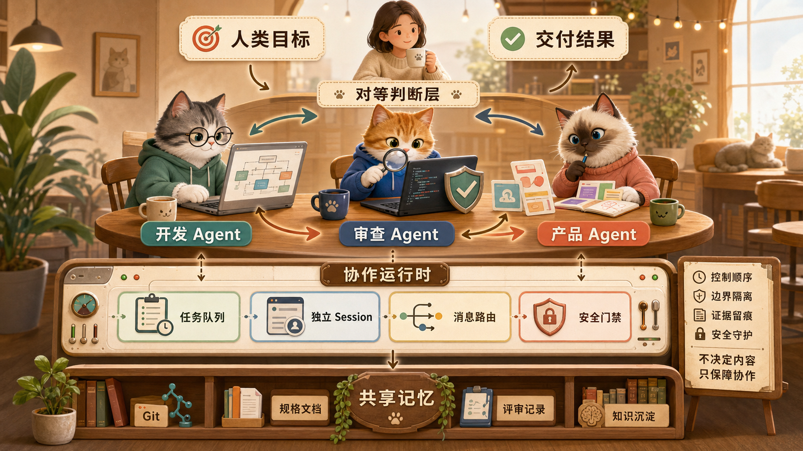

# Cat Café 学习资料

本目录集中保存 Cat Café 多 Agent 协作项目的学习与设计资料。

## 文档目录

1. [项目学习笔记](./cat-cafe-tutorials-study-notes.md)：项目定位、架构、课程地图、核心机制、生产教训和学习路线。
2. [协作运行时框架思路](./cat-cafe-runtime-framework.md)：第一阶段需要构建的基础框架、模块划分和实施顺序。

## 核心思想图

## 相关项目

- 教程仓库：<https://github.com/zts212653/cat-cafe-tutorials>
- 实际源码：<https://github.com/zts212653/clowder-ai>
