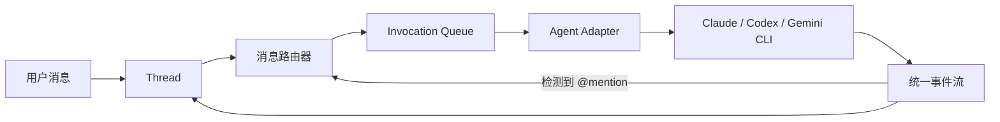

# Cat Café 协作运行时框架思路

> 本文只描述第一阶段架构与建设顺序，不包含具体代码。

## 1. 首先要构建什么

Cat Café 首先需要构建的不是聊天 UI、语音系统或 Boss Agent，而是一个可靠的**多 Agent 协作运行时骨架**。

第一阶段的最小闭环：



目标是让用户可以向一个 Agent 发消息，Agent 能回复并显式 `@` 另一个 Agent，系统可以安全、可追踪地继续执行。

## 2. 六个基础模块

### 2.1 统一领域模型

首先定义：

- `Agent`：身份、能力、CLI 类型和规则；
- `Thread`：一次独立协作空间；
- `Message`：人类或 Agent 发送的消息；
- `Invocation`：一次 Agent 执行；
- `SessionBinding`：Thread 与 CLI Session 的绑定；
- `RouteEdge`：Agent 之间的转交关系；
- `AgentEvent`：CLI 产生的统一事件。

必须明确区分：

| 概念 | 含义 |
| --- | --- |
| Thread | 用户看到的一次协作对话 |
| Invocation | 一次具体的 Agent 调用 |
| Session | 某个 CLI 保存的模型上下文 |

### 2.2 Agent Adapter

用统一适配层封装不同 CLI，负责：

- 启动、取消和恢复 CLI；
- 传递 prompt 与工作目录；
- 读取流式输出；
- 区分 stdout 和 stderr；
- 提取 Session；
- 处理超时、退出码和异常；
- 转换为统一事件。

推荐的统一事件包括：`text_delta`、`tool_call`、`tool_result`、`callback`、`warning`、`error` 和 `completed`。

### 2.3 Invocation Queue

队列负责执行秩序，而不是内容判断：

- 保存待执行调用；
- 控制 Agent 并发；
- 保证相同 Session 串行；
- 管理运行、完成、失败和取消状态；
- 支持超时、重试和幂等。

初期策略：不同 Agent 可以并行；同一 Agent、同一 Thread 串行；同一 Session 严格串行。

### 2.4 Session Strategy

Session 隔离必须从第一版开始设计。推荐绑定键：

```text
agentId + threadId + workspaceId
```

基本规则：

- 新 Thread 使用新的 Agent Session；
- 同一 Thread 再次调用相同 Agent 时恢复原 Session；
- 不同 Agent 不共享 Session；
- Session 恢复失败时创建新链并保留追踪信息；
- 不允许只按 `agentId` 保存一个全局 Session。

### 2.5 A2A 路由

第一版只支持显式 `@agent`：

1. Agent 回复完整落库；
2. 解析 `@mention`；
3. 校验目标身份；
4. 构造交接上下文；
5. 创建子 Invocation；
6. 加入队列；
7. 记录父子调用关系。

必须设置最大链深、最大 mention 数、连续轮次上限、重复触发保护，以及 `@human` 人工暂停点。

### 2.6 事件存储与审计

不能只保存最终消息，还应记录：

```text
message.created
invocation.queued
invocation.started
agent.text.delta
agent.callback.received
route.created
invocation.completed
review.blocked
review.approved
```

系统最终应能回答：谁触发了调用、用了什么 Session、为什么转交、在哪里失败、是否经过 Review，以及由谁明确放行。

## 3. 推荐分层

```text
接入层
├── HTTP API
├── WebSocket / SSE
└── 简单管理界面

协作层
├── Thread Service
├── Message Service
├── A2A Router
└── Handoff Builder

运行层
├── Invocation Queue
├── Agent Adapter
├── Session Strategy
└── Event Normalizer

安全层
├── 身份与权限
├── 最大调用链深度
├── 危险操作 Hook
├── 超时与取消
└── Review Gate

持久化层
├── Thread / Message
├── Invocation / Session
├── Route / Review
└── Audit Event
```

## 4. 建设顺序

### 里程碑 1：单 Agent 可控运行

完成用户、Thread、Queue、一个 CLI Adapter、流式事件和消息持久化。验证 stderr、异常退出、超时、取消和 Session 恢复。

### 里程碑 2：双 Agent 显式交接

实现“开发 Agent → `@reviewer` → 审查 Agent → 用户”的完整链路，并验证 Session 隔离、调用链追踪和循环终止。

### 里程碑 3：Review Gate

建立“实现 → Review → P1/P2 → 修复 → 复审 → 明确放行”流程。Reviewer 未明确放行时不能标记为可合入。

### 里程碑 4：主动回传

加入 MCP Callback，使 Agent 能在执行过程中汇报进度、请求其他 Agent、询问人类并发送结构化交接信息。

### 里程碑 5：安全与知识沉淀

加入危险操作 Hook、工作区隔离、证据闸门、结构化事故记录、Skills 和共享规则。

## 5. 第一阶段暂不实现

- 复杂聊天界面；
- Rich Blocks；
- TTS、ASR 和声音人格；
- PWA 和多平台消息入口；
- 插件市场；
- 高级知识检索；
- 自动选择 Agent；
- 大规模分布式队列；
- Boss Agent 自动拆解所有任务。

## 6. 核心原则

> Agent 负责判断，运行时负责边界、秩序、证据和安全。

第一阶段应追求一个功能克制但可靠的协作内核：即使只有两个 Agent，也不能串 Session、无限互调或丢失调用链，每一个完成结论都应有可核验的来源。

## 7. 模型供应商可替换原则

项目初期可以使用三个 OpenAI 模型，但系统不能把 OpenAI API 结构直接扩散到业务层。后续应能把任意角色替换为 Claude 或 Gemini，而不需要重写 Thread、路由、队列、Review 和存储模块。

需要遵守以下边界：

- 通过 `Agent Adapter` 隔离 OpenAI、Anthropic 和 Google 的 API、CLI、流式格式与错误类型；
- 业务层只使用统一的 `AgentInput`、`AgentEvent`、`ToolCall` 和 `Usage` 模型；
- Session 由应用自己的 `SessionBinding` 管理，供应商 Session ID 只作为外部引用保存；
- 工具定义使用项目内部 Schema，再由 Adapter 转换成各供应商格式；
- 不在路由逻辑中判断具体模型名称，而是根据角色、能力和策略选择 Agent；
- Prompt 分为供应商无关的角色规则与供应商专用适配片段；
- Review 证据、调用链和消息历史保存在项目数据库中，不能只依赖供应商后台；
- 对 token、费用、延迟和 finish reason 做统一归一化，同时保留原始响应便于排错；
- 为每个 Adapter 建立相同的契约测试，确保替换模型后行为边界不变；
- 使用能力声明处理差异，例如视觉输入、工具调用、结构化输出和上下文长度，避免假设所有模型能力完全一致。

推荐依赖方向：

```text
Thread / Router / Review / Queue
              ↓
       Provider-neutral Port
              ↓
  ┌───────────┼───────────┐
  ↓           ↓           ↓
OpenAI     Anthropic    Gemini
Adapter     Adapter      Adapter
```

模型替换应是配置行为，例如将 `reviewer` 从 OpenAI Agent 指向 Claude Agent，而不是修改业务代码。需要避免把 OpenAI 的 response ID、tool call ID、reasoning item 或专用参数当作项目的核心主键与领域概念。
