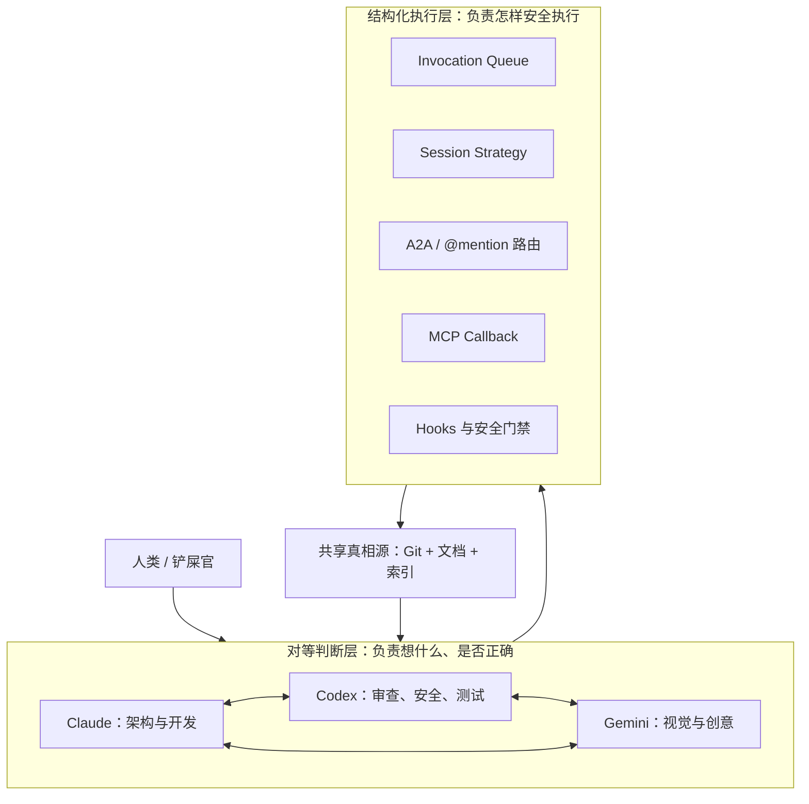

# Cat Café Tutorials 项目学习笔记

> 项目地址：<https://github.com/zts212653/cat-cafe-tutorials>  
> 实际源码：<https://github.com/zts212653/clowder-ai>  
> 整理日期：2026-08-02

## 1. 项目概览

`cat-cafe-tutorials` 不是 Cat Café 产品本身的源码仓库，而是一套基于真实项目演进记录编写的多 AI Agent 协作教程。它复盘了多个不同厂商的模型如何从“分别会写代码的工具”，逐渐变成一个能够讨论、交接、审查、纠错和积累经验的工程团队。

项目最初用三只“猫”代表三种模型及职责：

| 角色 | 模型 | 主要职责 |
| --- | --- | --- |
| 布偶猫 | Claude Opus | 主架构、核心开发 |
| 缅因猫 | Codex | Code Review、安全、测试 |
| 暹罗猫 | Gemini | 视觉设计、创意 |

教程后期扩展到更多模型和执行后端，但核心思想不变：**利用不同模型的独立判断和盲点差异形成制衡，而不是让一个中心 Agent 决定一切。**

这套教程适合：

- 想构建多 Agent 协作系统的开发者；
- 正在使用 Claude Code、Codex、Gemini CLI 等工具的人；
- 关心 AI 工程化、可审计性、生产安全和知识沉淀的人；
- 希望了解真实失败案例，而不只是理想化 Demo 的人。

它不等同于一键部署模板。要运行完整系统，应继续阅读 `clowder-ai` 源码仓库。

## 2. 一句话理解项目

Cat Café 将多模型 CLI、消息路由、会话隔离、MCP 回传、审查门禁、共享文档和知识索引组合起来，形成一个“上层对等决策、下层结构化执行”的 AI 协作系统。



关键边界是：

- 跨 Agent 协作坚持对等，任何 Agent 都可以质疑、否决或把任务转交给另一 Agent；
- 单个 Agent 内部可以采用 orchestrator/sub-agent 等编排方式；
- 队列只负责任务执行秩序，不替 Agent 做内容判断；
- Git、规格文档、审查记录和证据索引承担持久记忆，不能依赖模型“记住”。

## 3. 概念演进

教程用一条问题驱动的链路解释 Agent 的形成过程：

1. **聊天模型**：只能生成文本，没有操作外部世界的能力。
2. **Function Calling / Tool Use**：模型可以选择工具，但每个应用都要重复定义和接入工具。
3. **MCP**：用统一协议连接工具与模型应用，类似 AI 工具生态的标准接口。
4. **Skills**：不只告诉模型“有什么工具”，还封装“何时使用、如何检查、什么情况必须阻断”的操作知识。
5. **Agent**：模型结合工具、规则、记忆和循环执行能力，能够围绕目标持续行动。
6. **Multi-Agent**：多个独立 Agent 通过通信协议、角色分工和质量门禁共同完成任务。

这里最重要的认识是：**模型本身并不等于 Agent。Agent 是模型能力与工具、上下文、规则、状态和反馈循环的组合。**

## 4. 从 SDK 转向 CLI 的选型逻辑

项目早期考虑直接使用各家模型 SDK，后来转向调用现成 CLI。背后的工程判断是：

- SDK 提供较底层的模型调用能力，但工具使用、权限、上下文压缩、会话恢复和工程工作流往往需要自行补齐；
- Claude Code、Codex、Gemini CLI 等已经封装了大量 Agent 运行时能力；
- 通过统一适配层包装不同 CLI，可以把精力集中在跨 Agent 协作，而非重复实现单 Agent 基础设施；
- CLI 不能被当成普通、稳定、只输出 stdout 的子进程，必须正确处理流式输出、stderr、退出状态、超时和取消。

可抽象出类似的适配接口：

```ts
interface AgentAdapter {
  invoke(input: AgentInput): AsyncIterable<AgentEvent>;
  cancel(invocationId: string): Promise<void>;
  resume(sessionId: string, input: AgentInput): AsyncIterable<AgentEvent>;
}
```

适配层应统一的是事件语义，而不是粗暴地把所有 CLI 输出压成一段字符串。常见事件包括文本增量、工具调用、工具结果、错误、会话标识和完成状态。

## 5. 核心协作机制

### 5.1 A2A 路由与 `@mention`

Agent 在回复中 `@另一只猫`，系统识别 mention 并创建新的调用任务。实现时不能只做一个正则表达式，还要定义：

- 谁可以提及谁；
- mention 是普通文本还是结构化控制信号；
- 一条消息提及多个 Agent 时串行还是并行；
- 流式文本中 mention 被拆成多个 chunk 时如何识别；
- Agent `@人类` 时是否暂停后续链路；
- 如何限制循环、重复触发和无限对话；
- 消息如何保留发送者、thread、调用链和审计身份。

一个可靠的路由上下文至少应携带：

```ts
type RouteContext = {
  threadId: string;
  senderId: string;
  targetId: string;
  invocationId: string;
  parentInvocationId?: string;
  chainDepth: number;
  triggeredBy: "human" | "agent" | "system";
};
```

### 5.2 MCP Callback：让 Agent 主动回传

只依赖“主进程等待 CLI 完成后读取输出”不够，因为 Agent 在工作过程中可能需要主动汇报、提问或请求另一 Agent。项目使用 MCP 工具作为回传通道，使 Agent 能在执行中把结构化消息发回 Cat Café。

典型链路是：

```text
Agent CLI
  → 调用 Cat Café MCP tool
  → MCP Server 校验身份和参数
  → 写入消息/事件系统
  → WebSocket 或消息流推送前端
  → 路由器根据 mention 决定是否触发下一 Agent
```

这使交互从单向 RPC 变成事件驱动协作，但同时必须解决鉴权、幂等、重复消息、顺序、失败重试和来源审计。

### 5.3 Session 隔离

Session 是多 Agent 系统最容易被低估的状态。若仅按 Agent 保存一个 session，多个 thread 会共享上下文，导致“茶话会夺魂”式的跨 thread 污染。

合理的 session key 至少要包含 Agent 和工作上下文：

```text
sessionKey = agentId + threadId + workspace/feature scope
```

还要明确：

- 新 thread 是否创建新 session；
- 同一 thread 内是否延续 session chain；
- session 不可恢复时如何降级；
- 并发调用是否进入同一执行槽；
- 历史消息、CLI 原生会话和应用数据库之间谁是真相源。

### 5.4 Invocation Queue

执行队列负责结构化调度：限制并发、保证单个 Agent 的会话顺序、处理取消和超时，并把任务状态暴露给 UI。它是“交通系统”，不是 Boss Agent：可以决定哪个调用先运行，但不决定技术方案是否正确。

## 6. 没有 Boss Agent 的两层架构

教程第十二课给出了项目最有辨识度的架构选择。

### 对等判断层

- 每个 Agent 独立形成判断；
- 任何 Agent 可以质疑或否决其他 Agent；
- 先独立调研，再交叉校准，降低锚定效应；
- 尽量采用跨模型、跨厂商 Review，利用模型盲点差异；
- 真正需要产品价值判断的问题才升级给人类。

### 结构化执行层

- Invocation Queue 统一调度；
- Session Strategy 提供隔离的执行槽；
- A2A Routing 传递任务和上下文；
- Hooks 阻止危险操作；
- Git、文档与知识索引提供共享真相源。

这种设计并不是“没有编排”，而是把**判断权**与**执行秩序**分开。中央编排通常得到“一份判断、N 份执行力”；Cat Café 追求“N 份独立判断，经制衡后形成共识”。

代价也很明显：

- 调用次数和成本更高；
- 共识形成更慢；
- 路由、会话和审计实现更复杂；
- 必须设计终止条件，否则容易形成 Agent 循环；
- 没有清晰规则时，对等协作会退化成无效聊天。

因此它适合高复杂度、高风险、需要多视角审查的任务，不必机械地用于所有简单需求。

## 7. 元规则：把 AI 弱点变成系统约束

教程把常见 AI 弱点映射成具体规则：

| AI 弱点 | 工程风险 | 对应约束 |
| --- | --- | --- |
| 幻觉 | 在证据不足时编造结论 | 关键前提不确定时停止并提问 |
| 讨好和趋同 | Review 变成 “Looks good” | 强制明确立场，按 P1/P2/P3 分级 |
| 缺乏持久记忆 | 交接丢失背景 | 交接必须包含 Why 与取舍 |
| 过度自信 | 自己判断修好便合入 | 修复后必须由 reviewer 明确放行 |
| 表演性同意 | 语气积极但未理解问题 | 复述技术问题、用代码和测试回应 |

### 交接五件套

每次跨 Agent 交接应包含：

1. **What**：具体完成或修改了什么；
2. **Why**：为什么这样做，原始问题和约束是什么；
3. **Tradeoff**：考虑并放弃了哪些方案；
4. **Open Questions**：仍不确定、需要重点关注什么；
5. **Next Action**：希望接手方执行什么动作。

`Why` 是其中最重要的一项。代码只能体现“最后怎么写”，无法完整表达需求边界、历史事故和被放弃的方案。

### Review 分级

- **P1**：功能错误、安全问题、数据损坏等阻断级风险，必须修复；
- **P2**：重要的可靠性、设计或测试缺陷，放行前必须修复；
- **P3**：不影响正确性的改进建议，可登记 backlog。

Review 必须给出证据、影响和可验证的修复条件。修复者不能自行宣布完成，只有 reviewer 的明确无条件放行才可通过合入门禁。

## 8. 从一句话到交付：双环 Feature 生命周期

项目不把人类的第一句话当作完整需求，而是使用两个循环。

### Discovery Loop

```text
模糊想法
→ 多 Agent 独立调研
→ 补齐用户场景、约束和风险
→ 交叉讨论与反驳
→ 形成愿景、Spec 和验收标准
```

### Delivery Loop

```text
Spec
→ 实现计划
→ 隔离开发
→ 自动测试
→ 跨模型 Review
→ 修复与复审
→ 证据验收
→ 人类愿景对照
→ 合入和知识沉淀
```

这里有一个很实用的提醒：**验收标准全部通过，不等于产品就是用户想要的。** AC 主要检查可描述、可测试的局部要求；最终还要回到最初愿景、真实使用路径和冷启动场景检查整体体验。

## 9. 生产事故带来的安全设计

第六课围绕“两次数据丢失”和“消失的 28 秒”展开。最重要的结论不是复盘某条命令，而是：不要把“请谨慎”当作安全机制。

生产安全应有多层防线：

1. **声明层**：共享规则明确禁止危险动作；
2. **执行层**：Hooks、权限和命令策略直接阻止删除、覆盖等操作；
3. **数据层**：Redis、数据库和工作区进行环境隔离，生产数据有备份与恢复路径；
4. **证据层**：操作前后记录状态，验收必须引用真实输出；
5. **流程层**：高风险变更需要 Review、演练和明确放行。

尤其要警惕：

- 开发和生产共用 Redis 或相同 key 前缀；
- 测试清理逻辑作用到真实数据；
- 把 stderr 当成无关噪声；
- 只看退出码，不验证真实状态；
- 用宽泛的递归删除命令处理临时目录；
- Agent 声称“已恢复/已通过”但没有可核验证据。

## 10. 三层记忆与知识工程

模型会话不是可靠的长期记忆。项目将记忆外置，并让经验逐步晋升：

| 层级 | 内容 | 作用 |
| --- | --- | --- |
| 工作记忆 | 当前 thread、session、调用链 | 支撑正在进行的任务 |
| 项目记忆 | Spec、设计文档、Review、决策记录 | 为后续任务提供可追溯上下文 |
| 组织记忆 | 结构化教训、共享规则、Skills、门禁 | 让错误不再重复发生 |

一条事故记录只有被写成 Markdown 还不够。有效的知识晋升管道应是：

```text
事件证据 → 结构化教训 → 可检索元数据 → 共享规则/Skill → 自动门禁 → 后续任务验证
```

可采用统一 frontmatter 和“七槽”教训模板，至少记录事件、影响、根因、证据、修复、预防规则与验证方法。联邦检索或索引层负责从分散的文档中召回相关知识。

## 11. 课程地图（第 0～15 课）

| 课程 | 核心主题 | 学习重点 |
| --- | --- | --- |
| 00 | Agent 概念演进 | Function Call、MCP、Skills、Agent 的问题驱动演进 |
| 01 | 从 SDK 到 CLI | 为什么复用成熟 CLI Agent 运行时 |
| 02 | CLI 工程化 | stderr、流式协议、隔离、幻觉与自检 |
| 03 | 元规则 | 从 AI 弱点设计可执行协作规范 |
| 04 | 多猫路由 | `@mention`、A2A 分发和链路控制 |
| 05 | MCP 回传 | Agent 在执行中主动发送结构化消息 |
| 06 | 生产事故 | 数据丢失取证与多层安全防线 |
| 07 | 平台化 | Rich Blocks、PWA、悄悄话和插件化 |
| 08 | Session 管理 | 防止跨 thread 上下文污染 |
| 09 | 上下文工程 | AC 全绿仍偏离用户意图的原因与修正 |
| 10 | 知识工程 | 三层记忆、元数据契约和文档治理 |
| 11 | 语音链路 | ASR、TTS、Voice Identity 和移动端 autoplay |
| 12 | 无 Boss Agent | 对等判断层与结构化执行层 |
| 13 | Feature 双环 | Discovery Loop 与 Delivery Loop |
| 14 | 从错误学习 | 文档真相源、联邦检索和知识晋升 |
| 15 | 长期运行 | Pack、门禁、工程纪律和 Vibe Coding 节奏 |

## 12. 推荐学习路径

### 第一阶段：建立正确心智模型

按 `00 → 01 → 02` 阅读。目标不是记 API，而是理解为什么单次模型调用、稳定 Agent 运行时和多 Agent 系统是三个不同层次的问题。

实践：为两个不同 CLI 写统一 adapter，保留流式事件、错误和 session ID。

### 第二阶段：做出最小协作闭环

按 `03 → 04 → 05 → 08` 阅读。实现：

- 两个 Agent；
- 一个 thread；
- `@mention` 路由；
- MCP 或等价 callback；
- 每个 `agentId + threadId` 独立 session；
- 最大链深和人工暂停点。

### 第三阶段：加入质量制衡

阅读 `06 → 09 → 10`。增加 P1/P2/P3 Review、明确放行信号、危险操作 Hook、证据闸门和结构化教训文档。

### 第四阶段：再考虑平台化

阅读 `07 → 11 → 12 → 15`。只有前面的安全和协作闭环稳定后，再加入富交互、语音、多端接入、插件与更多 Agent。

## 13. 可复用的最小落地方案

若要在自己的项目复制思想，可从以下组件开始：

```text
apps/
  web/                    # 对话与任务状态 UI
services/
  gateway/                # HTTP/WebSocket 接入
  router/                 # mention 与 A2A 路由
  runner/                 # CLI adapter + invocation queue
  callback-mcp/           # Agent 主动回传工具
packages/
  protocol/               # 统一事件、身份、调用链类型
  session/                # session key 与恢复策略
  safety/                 # hooks、权限、危险操作阻断
docs/
  features/               # Feature spec 与 AC
  reviews/                # Review 证据
  lessons/                # 结构化教训
  shared-rules.md         # 全体 Agent 共同规则
```

最小数据模型建议包含：

- `Thread`：用户可见的协作空间；
- `Message`：内容、发送者、目标与来源；
- `Invocation`：一次 Agent 执行及状态；
- `SessionBinding`：Agent、thread 与 CLI session 的绑定；
- `RouteEdge`：调用链父子关系；
- `ReviewFinding`：级别、证据、状态和验证结果；
- `KnowledgeItem`：教训、标签、来源和晋升状态。

## 14. 项目的优点与局限

### 优点

- 基于真实事故和演进记录，能看到失败方案与转折原因；
- 不把多 Agent 简化为 prompt 或角色扮演，强调队列、会话、Hook 和真相源；
- 明确反对没有证据的“完成”声明；
- 通过跨模型 Review 抵消单一模型偏见；
- 将规则写成 Skill 和门禁，具备持续改进能力；
- 每课配有练习，便于从概念走向实现。

### 局限

- 教程带有项目叙事风格，概念、产品故事和工程细节交织；
- 部分结论来自单项目经验，不应直接当成所有团队的通用最优解；
- 对等多 Agent 会增加 token、延迟、基础设施和治理成本；
- 仓库本身主要是教程，理解完整实现仍需对照 `clowder-ai` 源码；
- 模型和 CLI 演进很快，具体参数与兼容行为需要以当前官方文档和实际测试为准。

## 15. 最值得带走的十条原则

1. 多 Agent 的价值首先是多份独立判断，不只是并行生成更多代码。
2. 判断层可以对等，执行层必须结构化。
3. 队列管理执行秩序，但不应垄断内容决策。
4. 先独立思考再互相阅读，能降低锚定和礼貌性趋同。
5. 跨模型 Review 能利用不同模型的盲点差异。
6. 交接必须写清 Why、Tradeoff 和 Open Questions。
7. 规则必须可检查、可阻断、可验证，不能只写“请谨慎”。
8. 测试通过只是证据之一，还要与用户最初愿景进行对照。
9. Session、身份、调用链和环境边界必须显式建模。
10. 真正的自我进化，是把错误从聊天记录晋升为知识、规则和自动门禁。

## 16. 阅读入口

- [项目 README](https://github.com/zts212653/cat-cafe-tutorials)
- [完整课程目录](https://github.com/zts212653/cat-cafe-tutorials/blob/main/docs/lessons/README.md)
- [第 3 课：元规则](https://github.com/zts212653/cat-cafe-tutorials/blob/main/docs/lessons/03-meta-rules.md)
- [第 4 课：多猫路由](https://github.com/zts212653/cat-cafe-tutorials/blob/main/docs/lessons/04-a2a-routing.md)
- [第 5 课：MCP 回传](https://github.com/zts212653/cat-cafe-tutorials/blob/main/docs/lessons/05-mcp-callback.md)
- [第 6 课：生产事故](https://github.com/zts212653/cat-cafe-tutorials/blob/main/docs/lessons/06-vanished-28-seconds.md)
- [第 12 课：没有 Boss Agent](https://github.com/zts212653/cat-cafe-tutorials/blob/main/docs/lessons/12-no-boss-agent.md)
- [第 13 课：一句话到交付](https://github.com/zts212653/cat-cafe-tutorials/blob/main/docs/lessons/13-from-sentence-to-ship.md)
- [实际源码仓库 clowder-ai](https://github.com/zts212653/clowder-ai)

---

总结：Cat Café Tutorials 真正展示的不是“让三种模型一起聊天”，而是如何把多个不稳定、会幻觉、会遗忘、会互相讨好的智能体，放入一个有身份、有边界、有证据、有制衡、有记忆的工程系统。它最有价值的部分，正是那些让 Agent **不能随意行动、必须说明依据、必须接受他者审查** 的设计。
